# 学生宿舍管理系统

 
#### 介绍
本系统是基于Java实现的学生宿舍管理系统，前端：Vue；后端：SpringBoot + Mybatis + Redis +Mysql；系统环境：jdk1.8 | mysql | redis | nodejs14+。有包含登录在内的十大功能模块，三个访问角色，满足基本的宿舍管理需求，

#### 软件架构
后端：SpringBoot + Mybatis + Redis +Mysql  
前端：Vue  
系统环境：jdk1.8 | mysql | redis | nodejs14+  

#### 功能结构
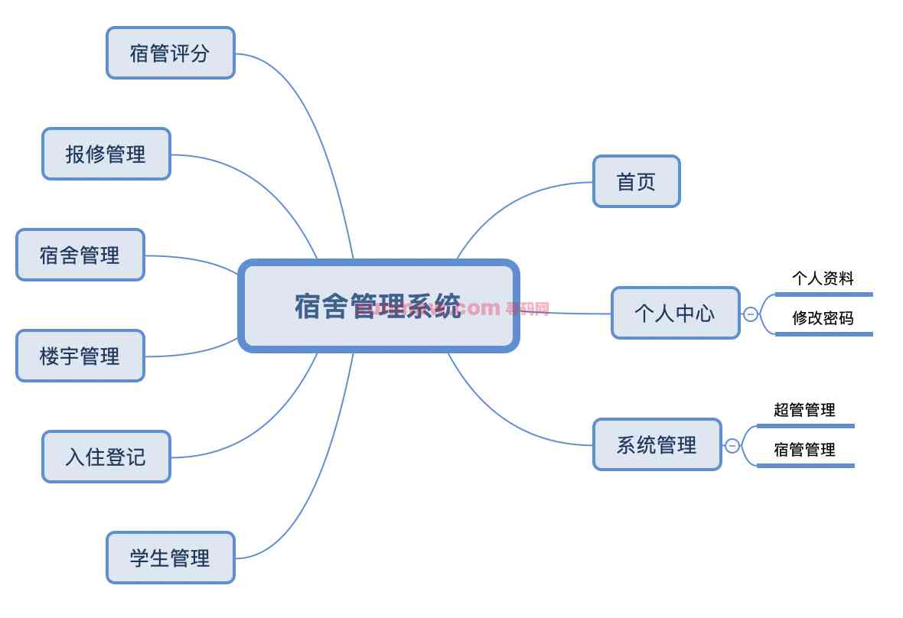
#### 功能介绍
##### 【代码结构与数据库截图】
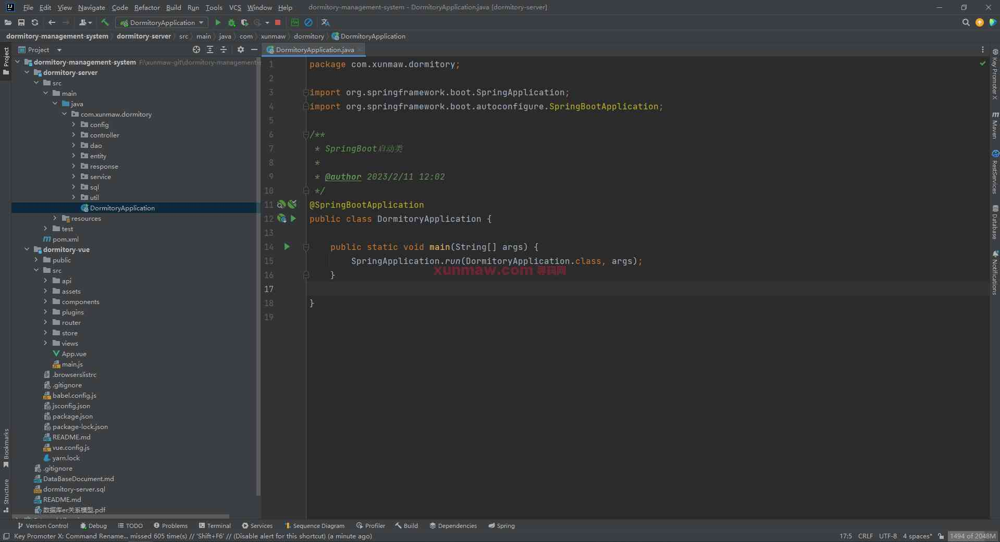
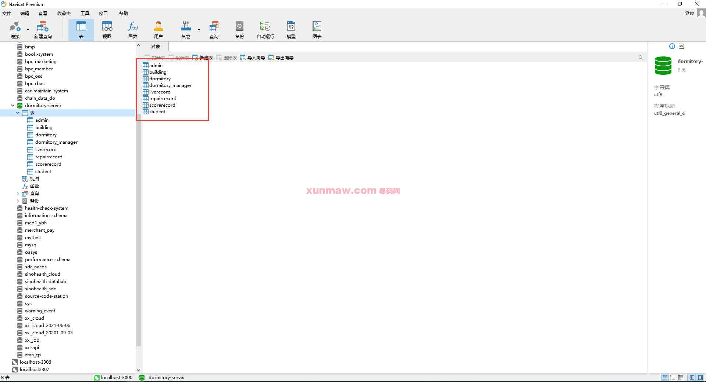

##### 【功能详述】 
在登录页面，填写账号、密码、验证码，验证成功可成功登录页面。  
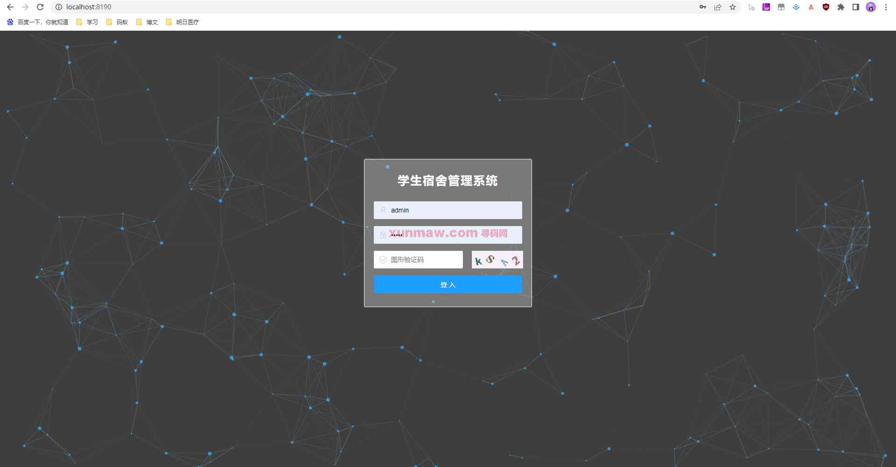
使用超级管理员账号登录后可看到所有功能入口。不同角色可访问与操作的页面如下：  
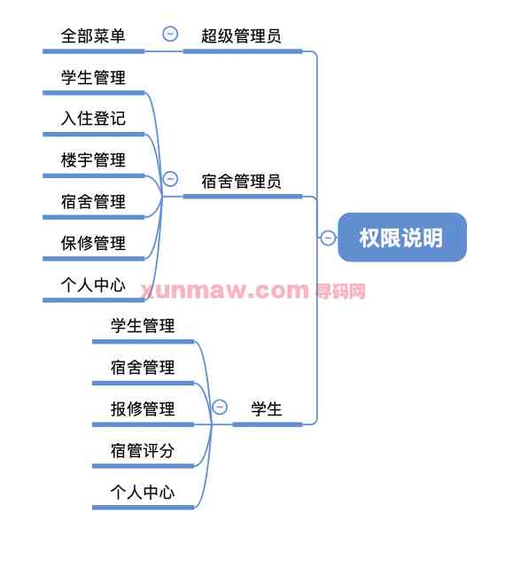

△首页  
成功登录后进入首页，左侧显示本系统的菜单栏，首页显示平台简介信息、简要统计数据、快捷功能入口。    
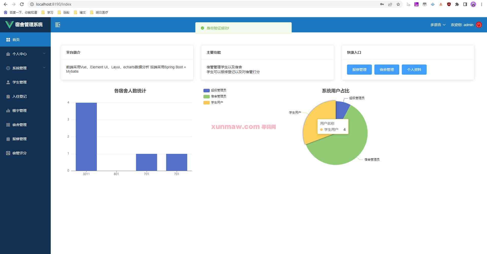

△个人中心  
包含【个人资料】的查看与账号【修改密码】功能。  
在个人资料中可以查看本账号基本信息：用户名、使用状态、身份等。  
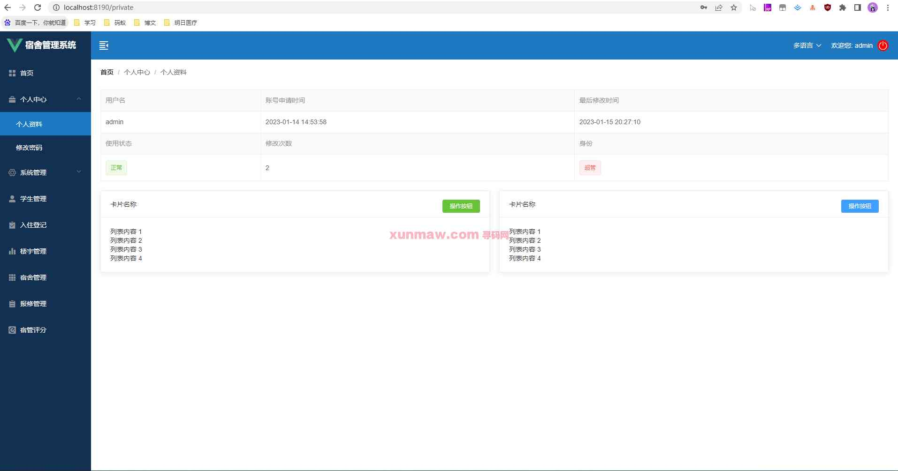
在修改密码中填写旧密码、新密码、并确认新密码可成功修改密码。 
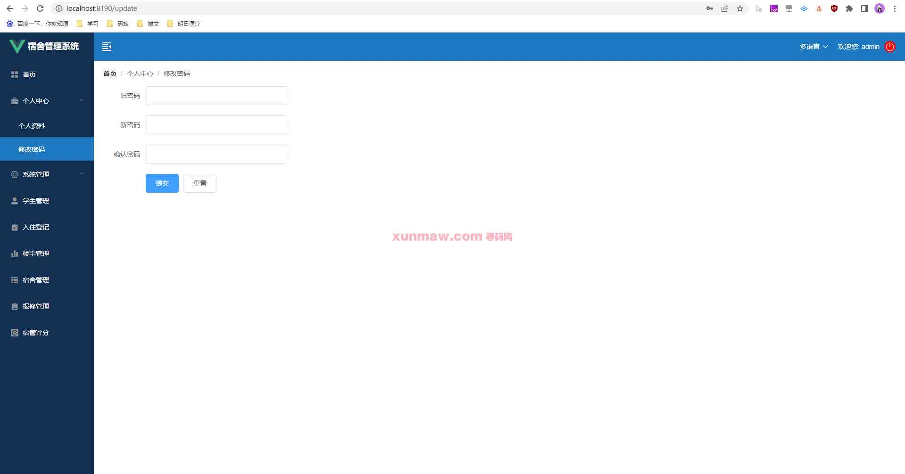

△系统管理  
系统管理包括【超管管理】与【宿管管理】。  
超管管理是对超管账号进行管理，宿管管理是对管理员账号进行管理，页面中欧可以对两类账号信息进行查询、添加、导出数据的操作。  
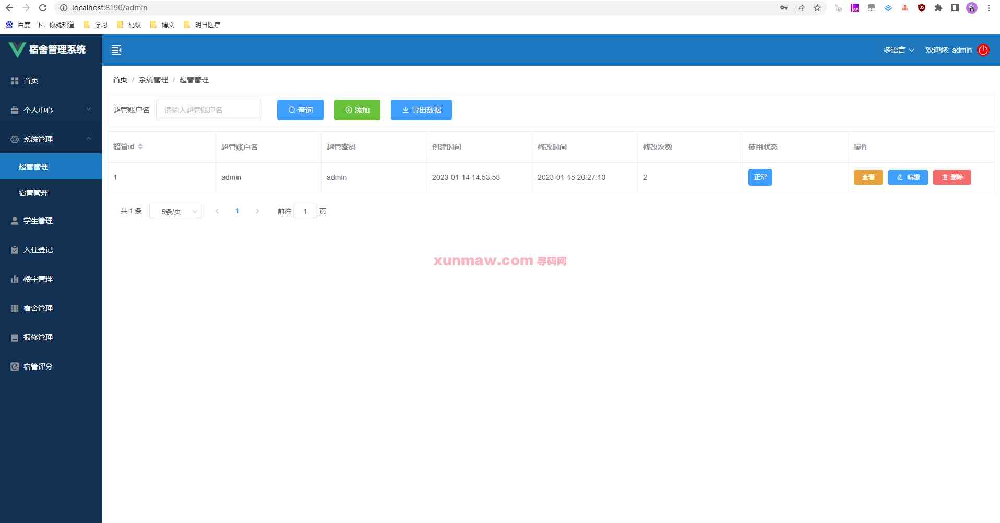

△学生管理  
显示学生账户的管理情况，可以对该类账户使用学生姓名、账户名的信息进行查询，同时支持单个添加账户与批量导入账户，也可以导出学生账户信息。  
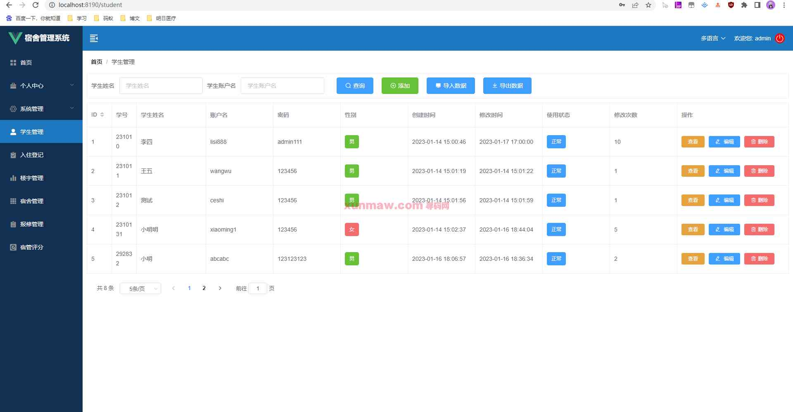

△入住管理  
登记学生入住信息，可以查询宿舍名称、可以添加入住数据，也可批量导出数据。针对单条入住数据可以进行查看、编辑、删除操作。  
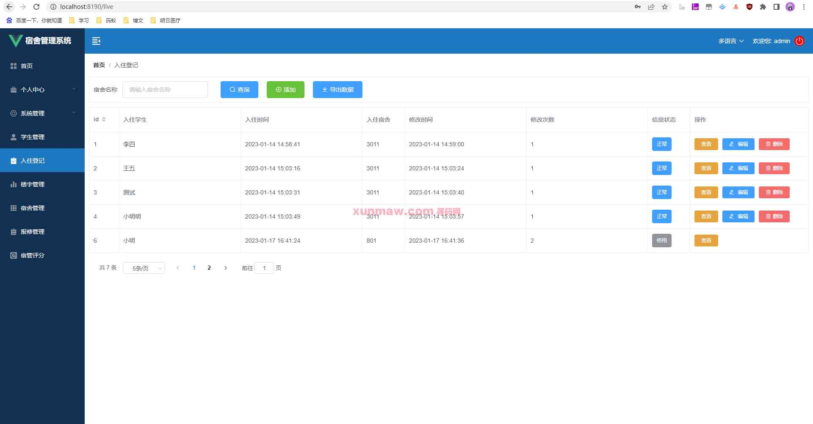

△楼宇管理  
楼宇管理显示宿舍楼的楼宇名称、位置、楼宇管理员信息。可以通过楼宇名称查询，可以添加与导出数据。针对单条数据可进行查看、编辑、删除操作。  
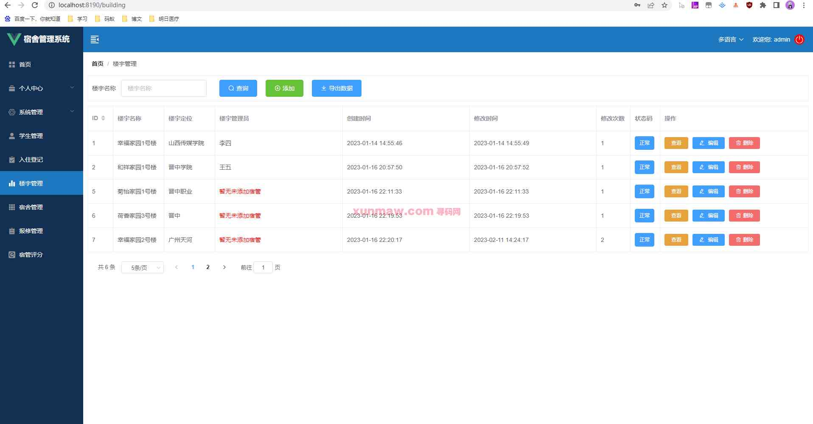

△宿舍管理  
显示宿舍信息，包含宿舍名称、所在楼宇、所在楼层、最多人数及目前入住人数。查看信息可了解当前入住的学生，支持编辑、删除宿舍。可以通过楼宇名称查询宿舍，同时支持单条数据添加与批量导入。  
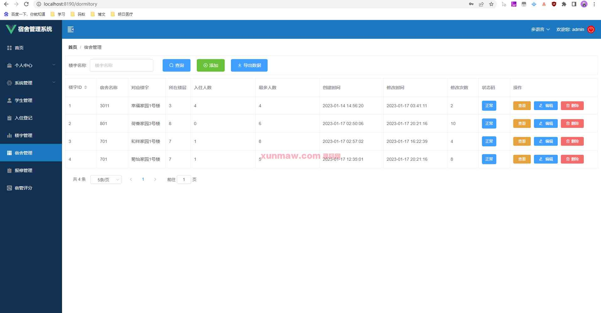

△报修管理  
显示当前宿舍报修情况，显示报修人、报修时间、报修信息、处理时间、修改时间等数据。可以处理报修并填写或修改处理数据。  
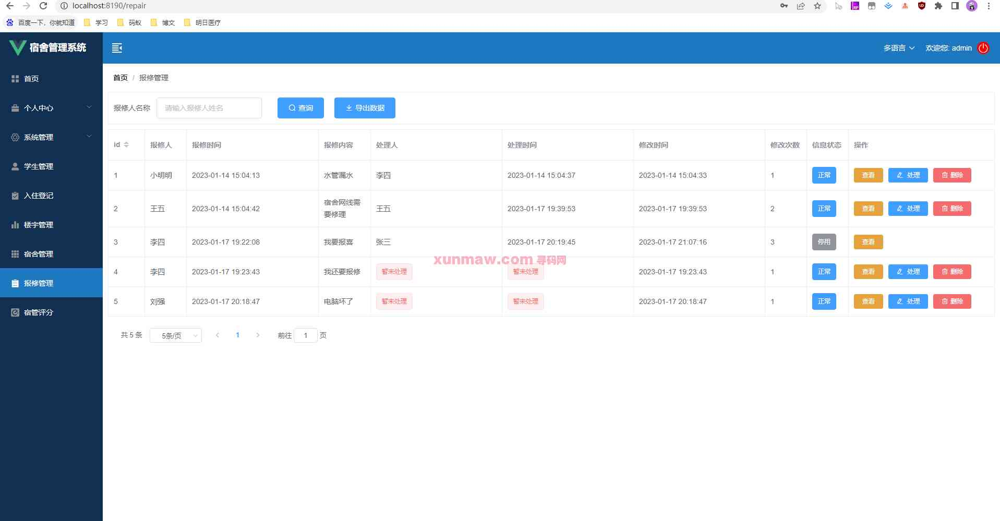

△宿管评分  
显示当前的宿管评分情况，并进行打分，可以批量导出评分数据。  
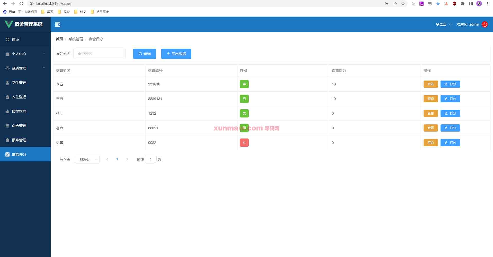

#### 使用说明
1. 创建数据库，执行数据库脚本
2. 修改jdbc数据库连接参数
3. 下载安装maven依赖jar
4. 在tomcat服务器部署项目  
    请求地址： http://localhost:8080/hotel-manage    
    用户名：admin  
    密码：admin  
